<!-- page_number: true -->
# 随机森林算法介绍
专业：2020计算机软件与理论
姓名：胡云卿

---
# 随机森林算法介绍
#### 一、决策树
#### 二、Bagging与随机森林
#### 三、实例
---
## 一、决策树
### 1.1 基本思想

决策树(decision tree) 是一类常见的机器学习方法。
顾名思义，决策树是基于树结构来进行决策的，这恰是人类在面临决策问题时一种很自然的处理机制。
<div  align="center">    
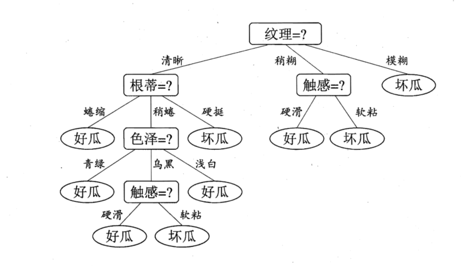
</div>


<!-- 一般的，一棵决策树包含一个根结点、若干个内部结点和若干个叶结点；叶结点对应于决策结果？其他每个结点则对应于一个属性测试；每个结点包含的样本集合根据属性测试的结果被划分到子结点中；根结点包含样本全集。从根结点到每个叶结点的路径对应了一个判定测试序列。即处理未见示例能力强的决策树，其基本流程遵循简单且直观的"分而治之" (divide-and-conquer) 策略， -->

---

#### 1.2 划分选择
#### 信息增益 
- 信息熵 (information entropy) 是度量样本集合纯度最常用的一种指标。

<div  align="center">    
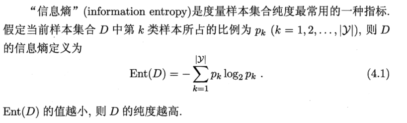
</div>

- 信息增益

<div  align="center">    
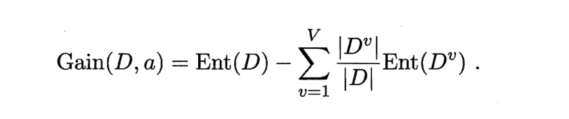
</div>

一般而言，信息增益越大，则意味着使该属性来进行划分所获得的"纯度提升"越大。

---

#### 增益率
问题：ID 属性参与分类是否有意义？
  - 属性的可能取值数目越多，信息增益越大。
- 计算公式
  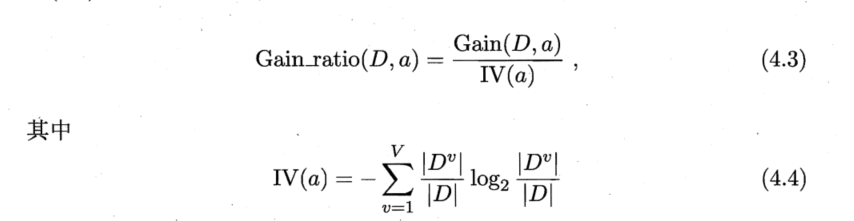

- 需注意的是，增益率准则对可取值数目较少的属性有所偏好。
  - C4.5 决策树算法，法并不是直接选择增益率最大的候选划分属性，而是使用了一个启发式，先从候选划分属性中找出信息增益高于平均水平的属性，再从中选择增益率最高的。

---

####  基尼指数
- CART 决策树。

  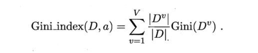

  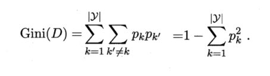

- 直观来说， 一个属性的 Gini 反映了从数据集中随机抽取两个样本，其类别标记不一致的概率。因此， Gini(D) 越小，则数据集的纯度越高。

---

### 2.3 剪枝

-    剪枝(pruning) 是决策树学习算法对付"过拟合"的主要手段。在决策树学习中，为了尽可能正确分类训练样本，结点划分过程将不断重复，有时会造成决策树分支过多，这时就可能因训练样本学得”太好"了，以致于把训练集自身的一些特点当作所有数据都具有的一般性质而导致过拟合。因此，可通过主动去掉一些分支来降低过拟合的风险。
- 预剪枝
- 后剪枝

---

## 二、Bagging与随机森林
### 2.1 集成学习

集成学习 (ensemble learning) 通过构建并结合多个学习器来完成学习任务

<div  align="center">    
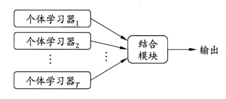
</div>


集成学习的结果通过投票法 产生？**少数服从多数**

<div  align="center">    
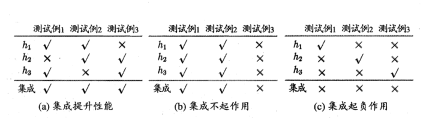
</div>

---
集成学习分类（根据个体学习器的生成方式）

- Boosting ：即个体学习器问存在强依赖关系、必须串行生成的序列化方法。
- Bagging 和 "随机森林”（Random Forest）：个体学习器间不存在强依赖关系、可同时生成的并行化方法。

---

### 2.2 随机森林

- 以决策树为基学习器构建 Bagging。
  - Bagging 
    - 并行式集成学习方法最著名的代表。
    - **有放回的构造单个基学习器的数据集**。
    - 简单投票法 / 简单平均法。
- 在决策树的训练过程中引入了**随机属性选择**。

  > <font size="3">具体来说，传统决策树在选择划分属性时是在当前结点的属性集合(假定有 个属性)中选择一个最优属性。而在RF 中，对基决策树的每个结点，先从该结点的属性集合中随机选择一个包含k个属性的子集，然后再从这个子集中选择一个最优属性用于划分。</font>

---

## 三、代码实现
### 3.1 数据源、环境

- 数据源：https://archive.ics.uci.edu/ml/datasets/Optical+Recognition+of+Handwritten+Digits
  - 数据属性输入属性都是0~16范围内的整数，一共64个属性。
  - 最后一个属性是类代码0 ~ 9

<div  align="center">    
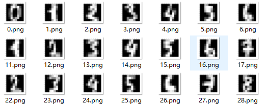
</div>

- Python 3.7 
  - scikit-learn 0.23.2

---

### 3.2 代码演示

- 决策树

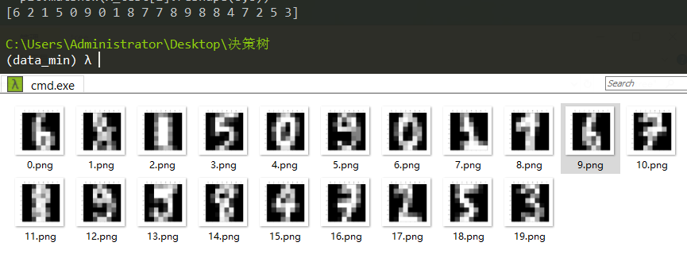

---
- 随机森林

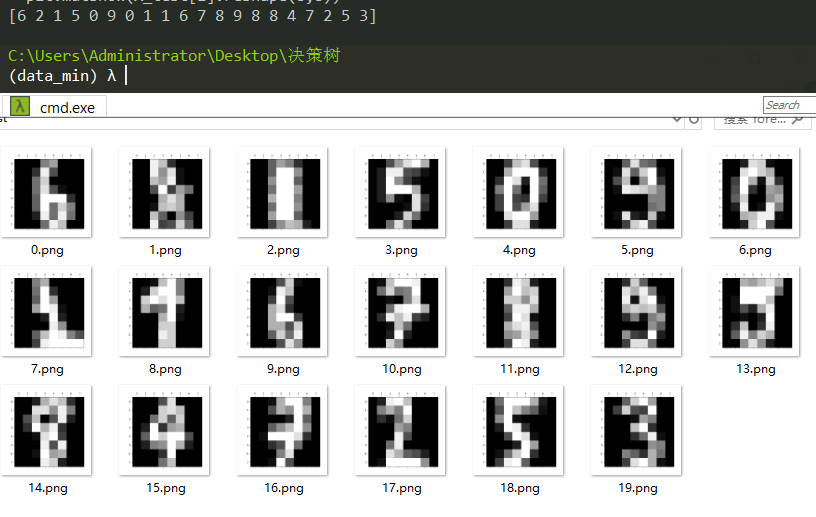

---

### 3.3 数据比较

- 预测准确率。
- K折交叉验证（k = 10）的准确率与方差。
- 训练及测试时间。

```bash
----tree----
[6 2 1 5 0 9 0 1 8 7]
tree Score: 0.84
tree Cross Avg. Score: 0.84 (+/- 0.07)
tree Time: 0.18
----forest----
[6 2 1 5 0 9 0 1 1 6]
forest Score: 0.97
forest Cross Avg. Score: 0.96 (+/- 0.02)
forest Time: 0.81
```
---
## 总结
- 决策树算法主要包括三个部分：特征选择、树的生成、树的剪枝。常用算法有 ID3、C4.5、CART。

- 特征选择。特征选择的目的是选取能够对训练集分类的特征。特征选择的关键是准则：信息增益、信息增益比、Gini 指数。

- 随机森林背后的思想是：每棵树的预测可能都相对较好，但可能对部分数据过拟合。如果构造很多树，并且每棵树的预测都很好，但都以不同的方式过拟合，那么我们可以对这些树的结果取平均值来降低过拟合。

---

## 参考
- 《机器学习》周志华
- https://zhuanlan.zhihu.com/p/32179140
- https://www.pythonf.cn/read/9682
- https://zhuanlan.zhihu.com/p/38121870

--- 

<div  align="center">    
汇报结束！谢谢大家！
</div>
